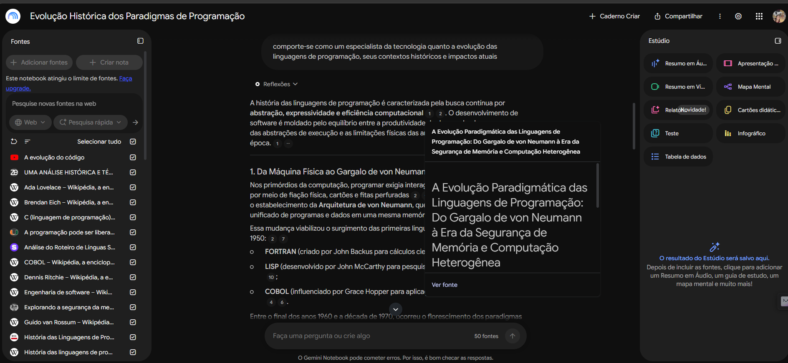
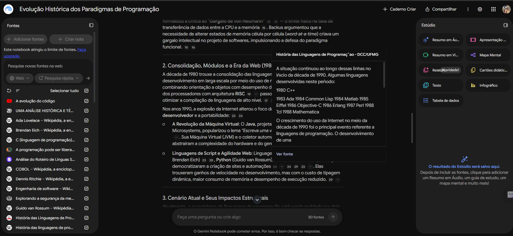
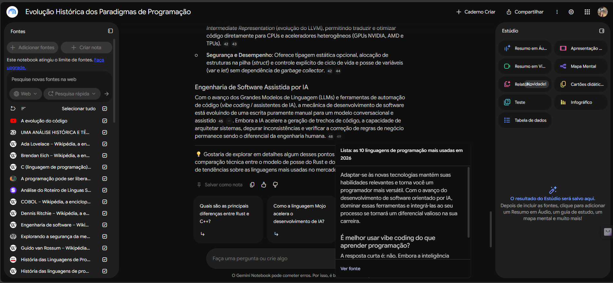
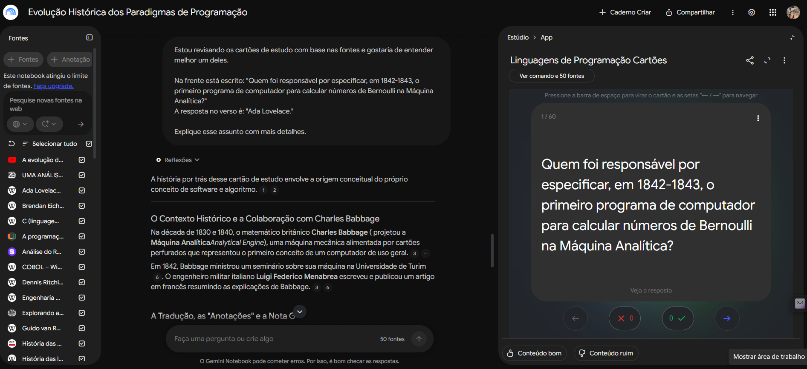
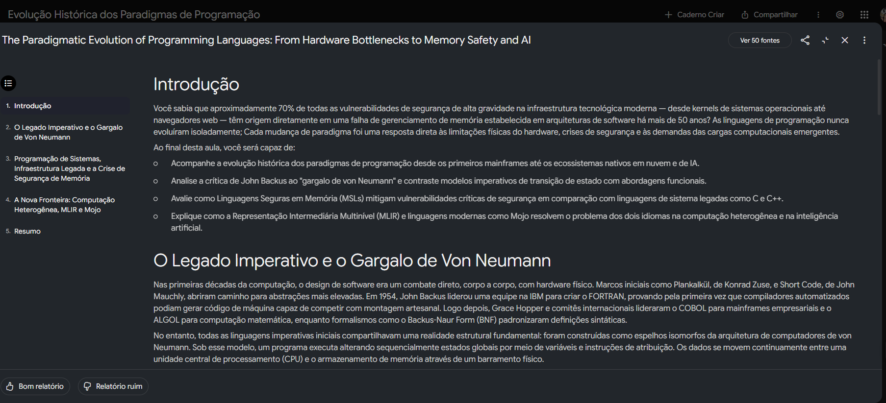
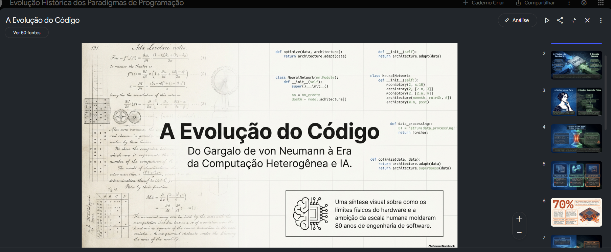

  
# 📈 Evolução Histórica e Paradigmas das Linguagens de Programação

## 📌 Tema e Objetivo
Este repositório documenta o estudo sobre a **evolução das linguagens de programação, seus contextos históricos e impactos atuais**. 
A partir do curso do Bootcamp **Accenture - Python para Análise e Automação de Dados**, da plataforma de estudos da [Dio.me](https://web.dio.me/),  tive o desafio de desenvolver esse projeto: 
**Treinando uma IA de Aprendizagem: Explore o Poder do NotebookLM**, que a partir de julho de 2026 chama-se Gemini Notebook. 
O objetivo do meu projeto é compreender como os paradigmas de programação surgiram, se transformaram ao longo do tempo e influenciam o desenvolvimento de software hoje.

## 📚 Fontes Utilizadas
As fontes consultadas foram:
- **Artigos acadêmicos e livros clássicos** sobre ciência da computação (ex.: "Structure and Interpretation of Computer Programs").
- **Documentação oficial de linguagens** (Cobol, Java, Python, C++ entre outras).
- **Publicações confiáveis** em sites como Wikipédia, IEEE e blogs técnicos de referência.
- **Notebook Gemini**: [Evolução Histórica dos Paradigmas de Programação](https://notebook.google.com/notebook/f4e299e8-d959-4acb-858a-f55be9de732e).

Confio nessas fontes porque são reconhecidas pela comunidade científica e tecnológica, possuem revisão por pares ou são mantidas por organizações oficiais das linguagens.

## 🧭 Diretriz de Comportamento
O notebook foi orientado pela seguinte diretriz:
> "Comporte-se como um especialista da tecnologia quanto à evolução das linguagens de programação, seus contextos históricos e impactos atuais."

Isso garantiu que as respostas fossem técnicas, contextualizadas e com foco em análise crítica.

## ❓ Perguntas e Respostas
Durante o estudo, foram feitas perguntas ao notebook, e cada resposta foi acompanhada da fonte correspondente:

- **Pergunta:** Quem foi o percursor da linguagem de computação?  
  **Resposta:** A resposta sobre quem foi o precursor das linguagens de computação depende do período histórico e do nível de abstração considerado: **Ada Lovelace (Anos 1840)**: É reconhecida como a **pioneira da programação e dos algoritmos** entre outras fontes (História das linguagens de programação – Wikipédia, a enciclopédia livre).  
  **Fonte:** Ada Lovelace – Wikipédia, a enciclopédia livre e Uma análise Histórica e Técnica da Evolução das Linguagens de Programação: Eficiência, Acessibilidade e Direções Futuras - Zenodo, entre outras fontes.

- **Pergunta:** Quais foram os primeiros paradigmas de programação?  
  **Resposta:** Os primeiros paradigmas de programação surgiram entre as décadas de 1950 e 1970 para abstrair a complexidade do hardware e oferecer diferentes formas de estruturar algoritmos e dados.  
  **Fonte:** A Evolução Paradigmática das Linguagens de Programação: Do Gargalo de von Neumann à Era da Segurança de Memória e Computação Heterogênea.

- **Pergunta:** Qual o impacto do paradigma orientado a objetos?  
  **Resposta:** O **Paradigma de Programação Orientada a Objetos (POO)** provocou uma das transformações mais profundas na engenharia de software, alterando radicalmente a forma como os desenvolvedores projetam, organizam e mantêm sistemas complexos.  
  **Fonte:** Engenharia de software e Linguagem de programação – Wikipédia, a enciclopédia livre; História das Linguagens de Programação - DCC/UFMG.

Cada resposta no notebook está acompanhada da referência explícita, garantindo rastreabilidade.

## 🔗 Notebook Compartilhado
O conteúdo base está disponível no notebook Gemini:  
[Evolução Histórica dos Paradigmas de Programação](https://notebook.google.com/notebook/f4e299e8-d959-4acb-858a-f55be9de732e)

---

### ✅ Checklist de Conformidade
- [x] Cada resposta citada mostra de qual fonte veio.  
- [x] O notebook abre pelo link.  
- [x] Nenhuma fonte contém dados pessoais ou materiais restritos.  
- [x] Todos os arquivos citados existem e têm conteúdo.  
- [x] O link enviado é do repositório público no GitHub.  
- [x] Nome do repositório legível, em minúsculas e sem acento.

---

## 📸 Visualização das Imagens do Notebook

Fontes das quais foram feitas as buscas - notas/números referem-se aos sites

Criação dos "Cartões Didáticos"

Criação de "Relatórios"

Criação de Mapa Mental

Criação da Apresentação de Slides - Power Point
 

---

📎 Link do curso: [DIO.me](https://web.dio.me/home) 

---
## 📝 Licença

Este projeto está sob a licença MIT. Veja o arquivo [LICENSE](LICENSE) para mais detalhes.

